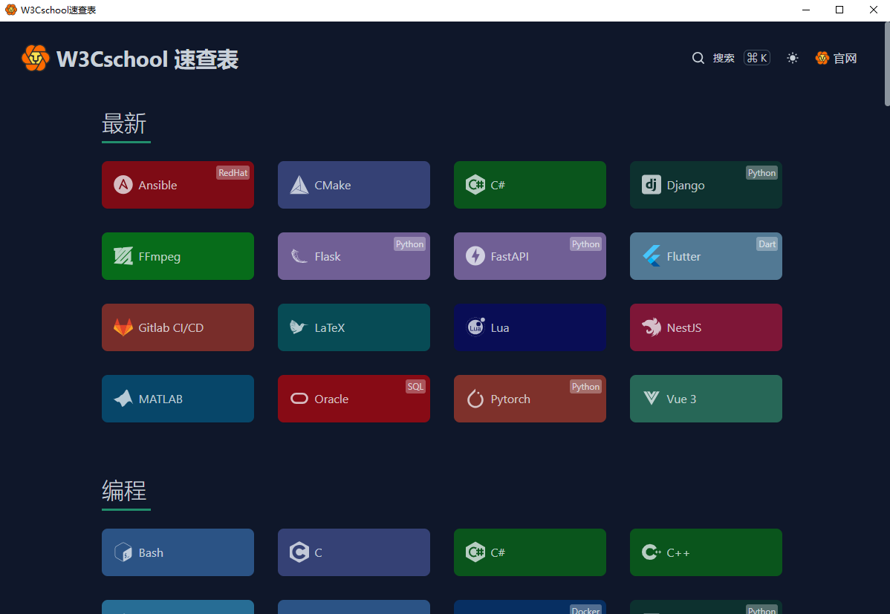
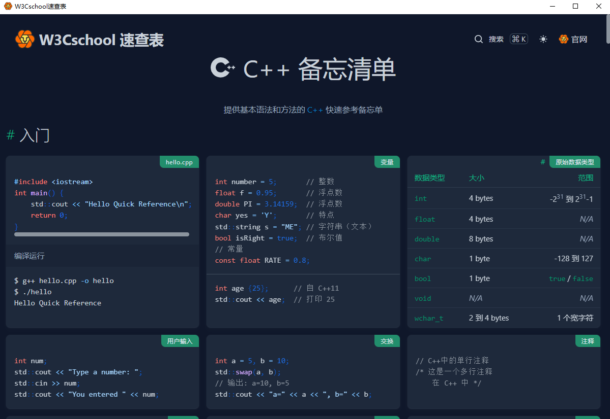
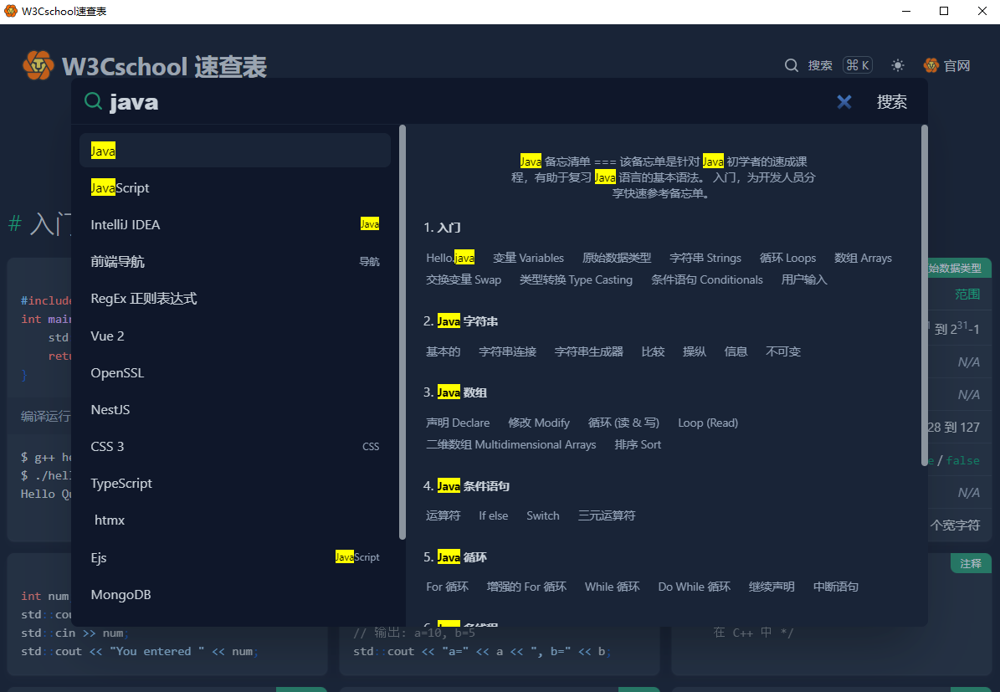

# Quick Reference 编程备忘清单【速查表】 PC客户端版

采用tauri简单的封装的速查表客户端, [内容来源](https://github.com/jaywcjlove/reference)
[贡献者](https://github.com/jaywcjlove/reference/graphs/contributors)列表

## 应用截图

## 快捷键
### 全局快捷键
Ctrl+Shift+G 唤起应用
### 快捷键
F11 切换最大化状态
## License

MIT © [Loen](https://github.com/lucoo01)

